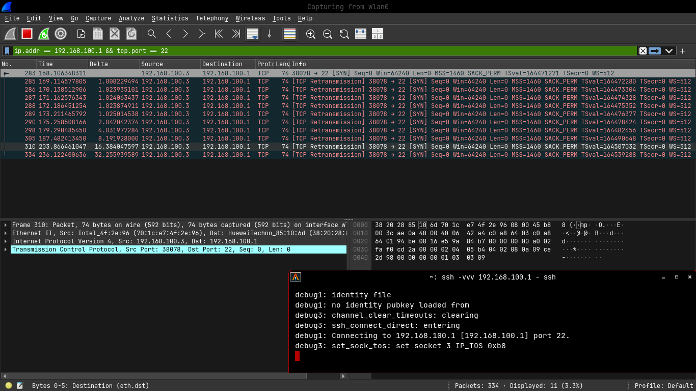

# Case Study: Bypassing and Triggering IPS Controls via Advanced Nmap Scanning

A hands-on analysis of personal router perimeter defenses, documenting how classic stealth scanning methods (Null/Xmas) bypassed initial firewall rulesets, and how the router's automated Intrusion Prevention System (IPS) responded with dynamic host isolation.

## Methodology & Commands Used
1. **Initial Reconnaissance (Failed):**
   ```bash
   nmap -sS -Pn -vv -T1 192.168.100.1
   ```
   *Result:* `Complete drop.` The firewall successfully dropped anomalous TCP SYN handshake attempts.

2. **Inverse Mapping via Protocol Anomalies (Success):**
   ```bash
   nmap -sN -Pn -vv -T1 192.168.100.1
   nmap -sX -Pn -vv -T1 192.168.100.1
   ```
   *Result:* `Successfully bypassed the stateful filter inspection.` Revealed 4 active daemons: DNS (53), SSH (22), Telnet (23), and an auxiliary management port.

## IPS Countermeasures Observed (The "Lockdown" Phase)
Upon initiating a secondary validation scan using the exact same TCP Null/Xmas parameters, the router’s firmware triggered an automated defensive action:
- **Behavior:** Immediate drop of all routing paths and local connections originating from the testing machine's MAC/IP address.
- **Technical Inference:** The embedded router firewall utilizes a threshold-based packet inspection ledger. Repeated stateless anomalies (such as invalid TCP flag combinations outlined in RFC 793) instantly transition the source host status into a strict temporary blacklist layer.

## Phase 3: Banner Grabbing on Port 23 (Telnet)
To footprint the target daemon without triggering the threshold-based IPS, a single-packet connection was established using Netcat:

```bash
❯ nc -vv 192.168.100.1 23
Connection to 192.168.100.1 23 port [tcp/telnet] succeeded!

Welcome Visiting Huawei Home Gateway
Copyright by Huawei Technologies Co., Ltd.

Login:
```

### Vulnerability Analysis & Footprinting Assessment:
1. **Target Identification:** The leaked string explicitly confirms the active environment is a **Huawei Home Gateway Architecture** (commonly deployed as GPON ONT variants like the HG8245 series).
2. **Threat Landscape:** Leaving Port 23 open introduces severe architectural vulnerabilities:
   - **Eavesdropping Risk:** Lack of TLS/SSL encryption implies that any authentication attempts can be sniffed in cleartext via standard packet capturing tools (e.g., Wireshark).
   - **IoT Botnet Target:** Devices with this profile are heavily targeted by automated credential-stuffing malware like **Mirai Botnet**, which systematically tests hardcoded factory backdoors (e.g., `telecomadmin` vectors) to enlist the hardware into a DDoS cluster.

## Phase 4: Forced Banner Grabbing via OpenSSH Verbose Engine (Stuck Condition)
To force a cryptographic response banner, a triple-verbose SSH probe was initiated:

```bash
❯ ssh -vvv 192.168.100.1
debug1: Connecting to 192.168.100.1 port 22.
debug3: set_sock_tos: set socket 3 IP_TOS 0xb8
[CONNECTION HUNG / INFINITE TIMEOUT]
```

### Post-Incident Forensic Analysis:
The diagnostic log explicitly cuts off exactly after setting the Socket Type of Service (`IP_TOS`). The failure to progress to the `Remote version string:` exchange phase provides definitive proof of a **TCP Blackholing / Silent Drop Policy** enforced by the Huawei Gateway IPS layer.

### Architectural Defense Mechanism:
1. **Host Quarantine:** Due to prior stateless structural anomalies detected during the TCP Null/Xmas scanning phases, the IPS has dynamically flagged the testing host’s IP/MAC address.
2. **Resource Exhaustion Mitigation:** Instead of responding with an explicit `TCP RST` (Reset) packet—which confirms target active status—the firewall absorbs incoming packets silently. This defense design forces malicious reconnaissance tools to hang indefinitely, successfully disrupting automated exploit automation chains.

### Visual Evidence: TCP Retransmission Matrix
Below is the live traffic capture from `wlan0` demonstrating the exponential backoff algorithm of the Linux kernel when encountering the router's silent-drop policy:




As captured in packet numbers 285 through 334, the local host (`192.168.100.3`) attempts systematic retransmission increments (1s -> 2s -> 4s -> 8s -> 16s -> 32s) before socket starvation occurs.
